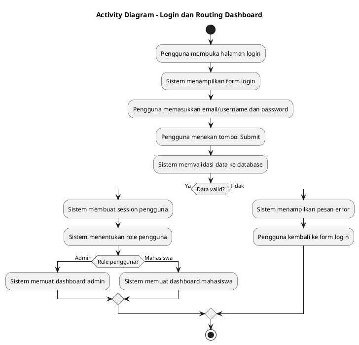
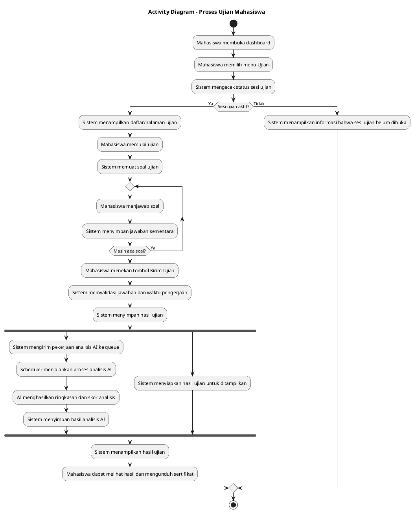
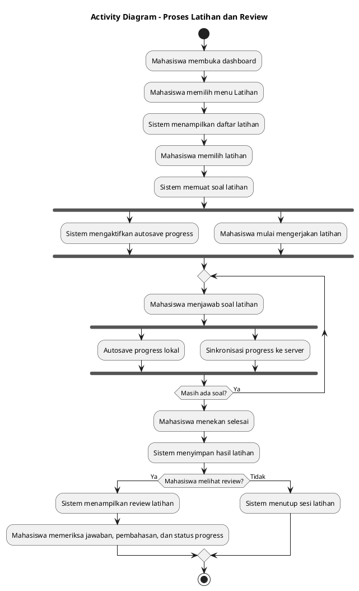
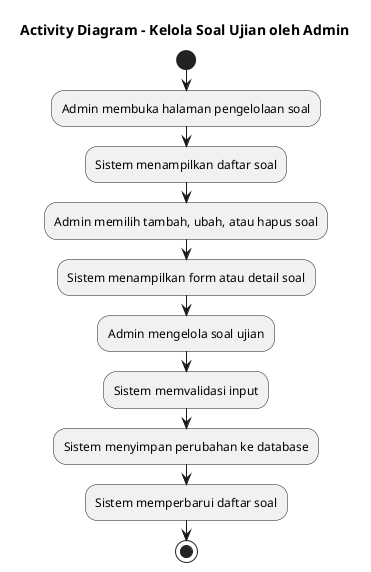
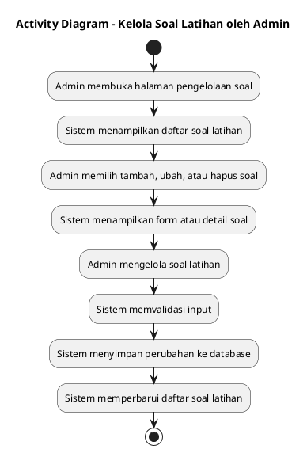
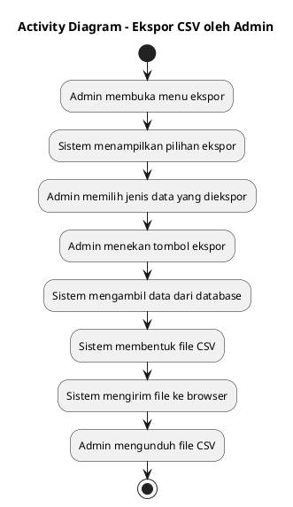
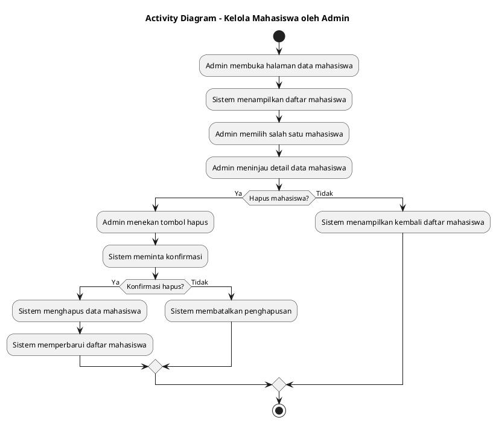

# Activity Diagram

Activity Diagram digunakan untuk menggambarkan alur kerja sistem, termasuk urutan aktivitas, percabangan keputusan, dan proses yang berjalan paralel. Pada sistem TOEFL Piksi, activity diagram yang paling relevan adalah alur login, alur ujian, alur latihan, dan alur admin.

## 1. Activity Diagram - Login dan Routing Dashboard

Diagram ini menunjukkan alur dasar ketika pengguna membuka sistem, melakukan autentikasi, lalu diarahkan ke dashboard sesuai perannya.

## 2. Activity Diagram - Proses Ujian Mahasiswa

Diagram ini menggambarkan alur utama saat mahasiswa mengerjakan ujian sampai hasil ujian tersimpan dan analisis AI diproses secara otomatis.

## 3. Activity Diagram - Proses Latihan dan Review

Diagram ini menunjukkan alur latihan mandiri mahasiswa, termasuk penyimpanan progress, sinkronisasi data, dan review latihan setelah selesai.

## 4. Activity Diagram - Kelola Soal Ujian oleh Admin

Diagram ini menunjukkan alur admin saat menambah, mengubah, atau menghapus soal ujian.

## 5. Activity Diagram - Kelola Soal Latihan oleh Admin

Diagram ini menunjukkan alur admin saat menambah, mengubah, atau menghapus soal latihan.

## 6. Activity Diagram - Ekspor CSV oleh Admin

Diagram ini menunjukkan alur ekspor data yang menghasilkan file CSV.

## 7. Activity Diagram - Kelola Mahasiswa oleh Admin

Diagram ini menggambarkan alur admin saat melihat dan menghapus data mahasiswa.

