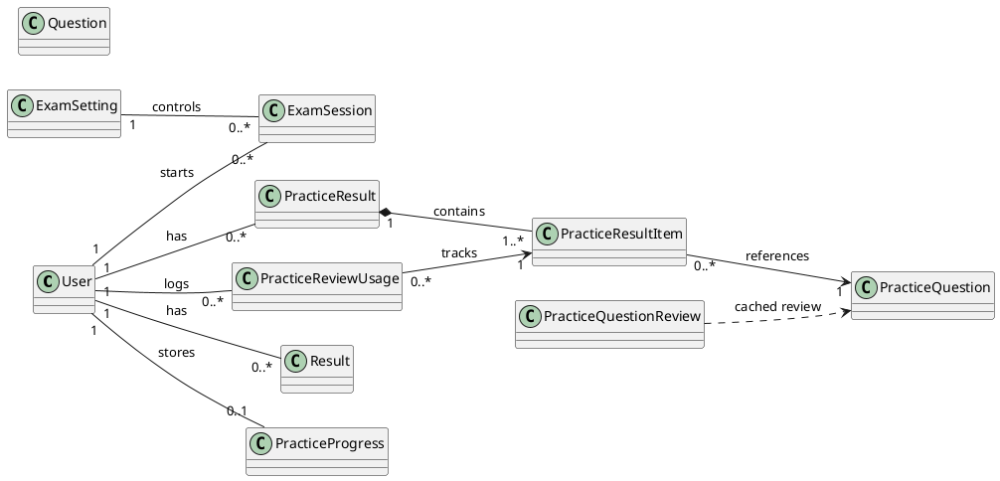
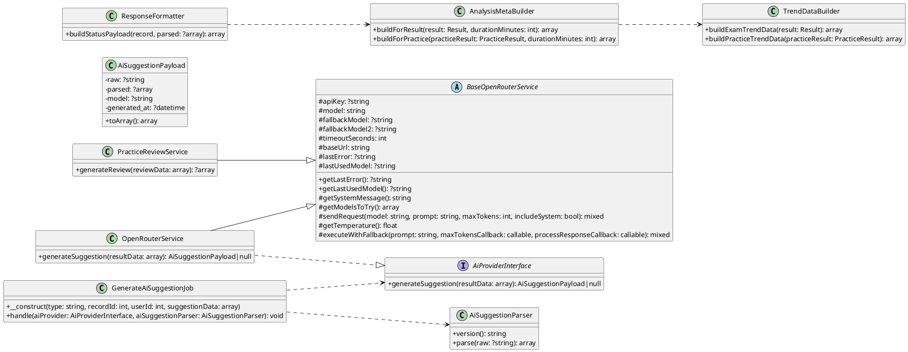

# C. Class Diagram

Class Diagram menggambarkan struktur statis sistem, yaitu kelas-kelas utama, atribut penting, operasi bisnis, dan relasi antar kelas. Untuk sistem TOEFL Piksi, diagram ini lebih baik disajikan dalam tiga lapis agar tidak berubah menjadi dump seluruh codebase:

1. High-Level Class Diagram, untuk menunjukkan entitas inti dan relasi utama.
2. Design Class Diagram, untuk menampilkan kelas layanan penting yang menggerakkan alur bisnis.
3. AI / Infrastructure Class Diagram, untuk menampilkan komponen teknis yang mendukung proses AI dan background job.

## 1. High-Level Class Diagram

Diagram ini fokus pada struktur domain utama dan relasi bisnis paling penting.

Catatan:
- `Question` adalah bank soal ujian.
- `PracticeQuestion` adalah bank soal latihan.
- `Result` menyimpan rekap ujian resmi.
- `PracticeResult` menyimpan rekap latihan.
- `PracticeResultItem` menyimpan detail jawaban per soal agar histori review tetap utuh.

## 2. Design Class Diagram

Diagram ini menampilkan kelas layanan utama yang menggerakkan use case bisnis. Helper internal dan method teknis kecil sengaja tidak ditampilkan agar diagram tetap fokus.

```plantuml
@startuml
left to right direction
skinparam classAttributeIconSize 0

package "Core Domain" {
  class User {
    - id: int
    - name: string
    - email: string
    - password: string
    - npm: string
    - class: string
    - role: string
    - profile_photo_path: ?string
    - streak_count: int
    - last_active_at: datetime
    - email_verified_at: datetime
    + results()
    + updateStreak(): bool
  }

  class Result {
    - id: int
    - user_id: int
    - exam_cycle: int
    - started_at: ?datetime
    - correct_listening: int
    - correct_structure: int
    - correct_reading: int
    - score_total: int
    - submitted_at: ?datetime
    - ai_suggestion: ?string
    - ai_generated_at: ?datetime
    - ai_model_used: ?string
    - ai_parsed_json: array
    - ai_status: ?string
    - ai_error: ?string
    - ai_requested_at: ?datetime
    - ai_completed_at: ?datetime
    + user()
    + scopeSubmitted()
    + scopeForUser(userId: int)
    + scopeLatestSubmitted()
    + scopeByCycle(cycle: int)
  }

  abstract class BaseResult {
    - id: int
    - user_id: int
    - total_questions: int
    - score_total: int
    - started_at: ?datetime
    - submitted_at: ?datetime
    + user()
  }

  class PracticeResult {
    - id: int
    - user_id: int
    - total_questions: int
    - correct_listening: int
    - correct_structure: int
    - correct_reading: int
    - score_total: int
    - started_at: ?datetime
    - submitted_at: ?datetime
    - ai_suggestion: ?string
    - ai_generated_at: ?datetime
    - ai_model_used: ?string
    - ai_parsed_json: array
    - ai_status: ?string
    - ai_error: ?string
    - ai_requested_at: ?datetime
    - ai_completed_at: ?datetime
    + user()
    + items()
    + scopeSubmitted()
    + scopeForUser(userId: int)
    + scopeLatestSubmitted()
  }

  class PracticeResultItem {
    - id: int
    - practice_result_id: int
    - practice_question_id: ?int
    - question_order: int
    - user_answer: ?string
    - is_correct: bool
    - question_hash: string
    - question_snapshot: array
    + practiceResult()
    + practiceQuestion()
  }

  class PracticeProgress {
    - id: int
    - user_id: int
    - question_ids: array
    - answers: array
    - active_question: int
    - time_left: int
    - tab_violation_count: int
    + user()
  }
  BaseResult <|-- Result
  BaseResult <|-- PracticeResult

  class ExamSession {
    - id: int
    - user_id: int
    - exam_setting_id: int
    - question_state: array
    - current_index: int
    - started_at: ?datetime
    - last_active_at: ?datetime
    - submitted_at: ?datetime
    + recordAnswer(questionId: int, answer: string): void
    + resume(): void
    + isActive(): bool
  }

}

package "Application Services" {
  class ExamControlService {
    + startSession(): array
    + closeSession(): array
  }

  class ExamFlowService {
    + prepareTest(userId: int): array
    + loadQuestionsByIds(questionIds: array): array
    + submitExam(userId: int, userAnswers: array): array
  }

  class PracticeFlowService {
    + generateOrGetQuestionIds(): array
    + loadQuestionsByIds(questionIds: array): array
    + submitPractice(userId: int, userAnswers: array, startedAt: ?string): array
  }

  class PracticeProgressService {
    + getProgress(userId: int, currentQuestionIds: array): ?array
    + saveProgress(userId: int, validated: array, currentQuestionIds: array): bool
    + clearProgress(userId: int): void
  }

  class PracticeReviewFlowService {
    + sessionsForUser(userId: int): array
    + showPayload(userId: int, practiceResult: PracticeResult): array
    + reviewItemForUser(userId: int, item: PracticeResultItem): array
  }

  class PracticeReviewService {
    + generateReview(reviewData: array): ?array
    + remainingQuota(userId: int): int
    + buildPromptData(item: PracticeResultItem): array
    + buildSnapshot(item: PracticeResultItem): array
    + buildResponsePayload(item: PracticeResultItem, review: array, cached: bool): array
    + personalNote(item: PracticeResultItem): string
  }

  class AiSuggestionService {
    + generateForExam(result: Result): AiSuggestionPayload|null
    + generateForPractice(practiceResult: PracticeResult): AiSuggestionPayload|null
    + buildExamStatusPayload(result: Result): array
    + buildPracticeStatusPayload(practiceResult: PracticeResult): array
    + dashboardSuggestionsForUser(userId: int): array
  }

  class QuestionSelectionService {
    + generateOrderedExamQuestionIds(): array
    + generateOrderedPracticeQuestionIds(): array
    + orderByIds(models, questionIds: array): array
  }

  class ScoringService {
    + convertScore(correct: int, category: string): float
    + calculateCorrectAnswers(questions, userAnswers: array): array
    + calculateTotalScore(listeningScore: float, structureScore: float, readingScore: float): int
    + calculateScoreSummary(correct: array): array
  }

  class DashboardService {
    + adminDashboardData(): array
    + studentDashboardData(user: User): array
    + leaderboardData(perPage: int, sortBy: string): array
  }

  class StudentStatsAggregator {
    + buildForUser(user: User): array
  }

  class LeaderboardAggregator {
    + buildForDisplay(perPage: int, sortBy: string): array
    + buildPaginatedForDisplay(perPage: int, sortBy: string): array
    + clearCache(): void
  }

  class StudentResultService {
    + dashboardData(userId: int): array
    + examHistoryData(userId: int): array
    + practiceHistoryData(userId: int): array
    + summary(modelClass: string, userId: int): array
  }

  class StudentDirectoryService {
    + indexData(filters: array): array
    + availableClasses(): array
    + deleteStudent(student: User): void
  }

  class QuestionExportService {
    + exportQuestions(questionRepo: QuestionRepository): StreamedResponse
    + exportPracticeQuestions(): StreamedResponse
  }

  interface QuestionRepository {
    + queryFiltered(filters: array)
  }

  class ProfilePhotoService {
    + storeOptimized(file): string
  }
}

User "1" -- "0..*" Result
User "1" -- "0..*" PracticeResult
User "1" -- "0..1" PracticeProgress
User "1" -- "0..*" PracticeReviewUsage
ExamSetting "1" -- "0..*" ExamSession
PracticeResult "1" *-- "1..*" PracticeResultItem
PracticeResultItem "0..*" --> "1" PracticeQuestion
PracticeReviewUsage "0..*" --> "1" PracticeResultItem
PracticeQuestionReview ..> PracticeQuestion

ExamFlowService ..> QuestionSelectionService
ExamFlowService ..> ScoringService
ExamFlowService ..> ExamSetting
ExamFlowService ..> Result
ExamFlowService ..> ExamSession

PracticeFlowService ..> QuestionSelectionService
PracticeFlowService ..> ScoringService
PracticeFlowService ..> PracticeQuestion
PracticeFlowService ..> PracticeResult
PracticeFlowService ..> PracticeResultItem

PracticeProgressService ..> PracticeProgress
PracticeReviewFlowService ..> PracticeReviewService
PracticeReviewFlowService ..> PracticeQuestionReview
PracticeReviewFlowService ..> PracticeReviewUsage
PracticeReviewFlowService ..> PracticeResult
PracticeReviewFlowService ..> PracticeResultItem

AiSuggestionService ..> Result
AiSuggestionService ..> PracticeResult
AiSuggestionService ..> TrendDataBuilder
AiSuggestionService ..> AnalysisMetaBuilder
AiSuggestionService ..> ResponseFormatter
AiSuggestionService ..> AiSuggestionParser

DashboardService ..> StudentStatsAggregator
DashboardService ..> LeaderboardAggregator
DashboardService ..> ExamSetting
StudentStatsAggregator ..> Result
StudentStatsAggregator ..> PracticeResult
StudentStatsAggregator ..> ExamSetting

StudentResultService ..> Result
StudentResultService ..> PracticeResult
StudentDirectoryService ..> User
QuestionExportService ..> QuestionRepository
QuestionExportService ..> PracticeQuestion
ProfilePhotoService ..> UploadedFile

@enduml
```

## 3. AI / Infrastructure Class Diagram

Diagram ini memisahkan komponen AI, parser, formatter, dan job queue agar tidak bercampur dengan domain inti.

## 4. Catatan Penyusunan

- Diagram pertama dipakai untuk memperlihatkan struktur domain inti secara ringkas.
- Diagram kedua dipakai untuk menunjukkan service layer utama, tetapi hanya method bisnis penting saja.
- Diagram ketiga dipakai untuk memisahkan AI pipeline dan background job agar tidak bocor ke domain utama.
- Helper internal seperti `cleanText`, `flattenReview`, atau detail parsing yang sangat teknis sengaja tidak dimasukkan ke diagram utama.
- Framework detail seperti `Request`, `Collection`, `LengthAwarePaginator`, dan `Storage` sengaja dikurangi agar class diagram tetap akademik dan mudah dibaca.
- Nama repository interface juga disederhanakan menjadi `QuestionRepository` agar lebih natural.
- Perubahan kecil: `BaseResult` sengaja dibiarkan sebagai abstraksi ringan saja; AI field tetap ada di `Result` dan `PracticeResult` karena untuk skala proyek ini itu masih pragmatis.
- `PracticeReviewService` sengaja tetap berada dekat domain review karena ia masih memegang quota, prompt, dan formatting; kalau nanti membesar, barulah masuk akal dipisah menjadi `PracticeReviewAiProvider`.
- `Question` dan `PracticeQuestion` tetap dipisah karena diagram ini masih mengasumsikan lifecycle dan pengelolaan soal yang berbeda; kalau ternyata struktur datanya identik, barulah kandidat refactor ke satu model bertipe.
- `QuestionExportService` sebaiknya dibaca sebagai penghasil `StreamedResponse`, bukan stream mentah, supaya kontrak ekspor lebih jelas.
- Ditambahkan `AiProviderInterface` agar job dan service tetap ter-decouple dari implementasi konkret (mis. `OpenRouterService`).
