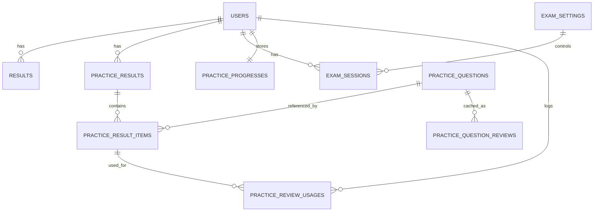

# ERD Sistem TOEFL CBT

Dokumen ini merangkum entitas data utama, relasi, dan tabel pendukung yang ada pada aplikasi.

## 1. ERD Inti

## 2. Entitas Utama

### 2.1 `users`
Menyimpan akun admin dan mahasiswa.

- PK: `id`
- Kolom penting: `name`, `email`, `password`, `npm`, `class`, `role`, `profile_photo_path`, `streak_count`, `last_active_at`, `email_verified_at`
- Relasi:
  - 1..N ke `results`
  - 1..N ke `practice_results`
  - 1..N ke `exam_sessions`
  - 1..1 ke `practice_progresses`
  - 1..N ke `practice_review_usages`

### 2.2 `questions`
Bank soal ujian utama.

- PK: `id`
- Kolom penting: `category`, `passage`, `audio_path`, `audio_transcript`, `question_text`, `option_a`, `option_b`, `option_c`, `option_d`, `correct_answer`
- Catatan:
  - Tidak punya foreign key langsung ke tabel lain.
  - Dipakai saat ujian berjalan, lalu hasil akhirnya disimpan ke `results`.

### 2.3 `results`
Rekap hasil ujian resmi per user.

- PK: `id`
- FK: `user_id` -> `users.id`
- Kolom penting: `exam_cycle`, `started_at`, `submitted_at`, `correct_listening`, `correct_structure`, `correct_reading`, `score_total`
- Kolom AI: `ai_suggestion`, `ai_generated_at`, `ai_model_used`, `ai_parsed_json`, `ai_parser_version`, `ai_status`, `ai_error`, `ai_requested_at`, `ai_completed_at`
- Catatan:
  - Menyimpan ringkasan nilai, bukan detail jawaban per soal.
  - Memiliki index pada `exam_cycle`, `submitted_at`, dan kombinasi laporan.

### 2.4 `exam_settings`
Konfigurasi status ujian dan cycle aktif.

- PK: `id`
- Kolom penting: `is_open`, `current_cycle`
- Catatan:
  - Dipakai sebagai data kontrol ujian.
  - Model aplikasi memperlakukannya seperti singleton config.

### 2.5 `exam_sessions`
Menyimpan sesi ujian yang sedang berjalan.

- PK: `id`
- FK: `user_id` -> `users.id`
- FK: `exam_settings_id` -> `exam_settings.id`
- Kolom penting: `exam_cycle`, `question_ids`, `current_question_index`, `answers`, `status`, `started_at`, `submitted_at`, `abandoned_at`
- Catatan:
  - `question_ids` dan `answers` disimpan dalam JSON.
  - Status: `in_progress`, `submitted`, `abandoned`.

### 2.6 `practice_questions`
Bank soal latihan.

- PK: `id`
- Kolom penting: `category`, `passage`, `audio_path`, `audio_transcript`, `question_text`, `option_a`, `option_b`, `option_c`, `option_d`, `correct_answer`, `deleted_at`
- Catatan:
  - Memakai soft delete.
  - Dipakai pada latihan mandiri, terpisah dari soal ujian utama.

### 2.7 `practice_results`
Rekap hasil latihan per user.

- PK: `id`
- FK: `user_id` -> `users.id`
- Kolom penting: `total_questions`, `correct_listening`, `correct_structure`, `correct_reading`, `score_total`, `started_at`, `submitted_at`
- Kolom AI: `ai_suggestion`, `ai_generated_at`, `ai_model_used`, `ai_parsed_json`, `ai_parser_version`, `ai_status`, `ai_error`, `ai_requested_at`, `ai_completed_at`
- Catatan:
  - Mirip `results`, tetapi khusus latihan.
  - Memiliki index pada `user_id` dan `submitted_at`.

### 2.8 `practice_result_items`
Detail jawaban per soal pada satu hasil latihan.

- PK: `id`
- FK: `practice_result_id` -> `practice_results.id`
- FK opsional: `practice_question_id` -> `practice_questions.id`
- Kolom penting: `question_order`, `category`, `question_text`, `option_a`, `option_b`, `option_c`, `option_d`, `correct_answer`, `user_answer`, `is_correct`, `question_hash`, `question_snapshot`
- Catatan:
  - Menyimpan snapshot soal agar histori tetap utuh walau bank soal berubah.

### 2.9 `practice_progresses`
Menyimpan progress latihan yang belum selesai.

- PK: `id`
- FK: `user_id` -> `users.id`
- Kolom penting: `question_ids`, `answers`, `active_question`, `time_left`, `tab_violation_count`
- Catatan:
  - `user_id` bersifat unik, jadi satu user hanya punya satu progress aktif.
  - JSON dipakai untuk menyimpan daftar soal dan jawaban sementara.

### 2.10 `practice_question_reviews`
Cache review AI untuk soal latihan.

- PK: `id`
- Kolom penting: `question_hash`, `question_snapshot`, `ai_review_json`, `ai_review_text`, `ai_model_used`, `ai_generated_at`, `expires_at`
- Catatan:
  - Tidak punya foreign key langsung.
  - Terhubung secara logis lewat `question_hash`.

### 2.11 `practice_review_usages`
Log pemakaian review AI.

- PK: `id`
- FK: `user_id` -> `users.id`
- FK: `practice_result_item_id` -> `practice_result_items.id`
- Kolom penting: `question_hash`, `from_cache`, `generated`
- Catatan:
  - Dipakai untuk audit apakah review berasal dari cache atau digenerate baru.

## 3. Relasi Utama

- `users` 1..N `results`
- `users` 1..N `practice_results`
- `users` 1..N `exam_sessions`
- `users` 1..1 `practice_progresses`
- `users` 1..N `practice_review_usages`
- `exam_settings` 1..N `exam_sessions`
- `practice_results` 1..N `practice_result_items`
- `practice_questions` 1..N `practice_result_items` melalui `practice_question_id`
- `practice_result_items` 1..N `practice_review_usages`
- `practice_questions` 1..N `practice_question_reviews` secara logis lewat `question_hash`

## 4. Tabel Pendukung Framework

Tabel berikut ada di database, tetapi biasanya tidak dimasukkan ke ERD domain bisnis utama.

- `jobs`: antrian background job.
- `failed_jobs`: log job yang gagal diproses.
- `personal_access_tokens`: token API Laravel Sanctum.
- `password_reset_tokens`: token reset password.

## 5. Catatan Desain

- `questions` dan `practice_questions` adalah bank soal yang terpisah.
- `results` hanya menyimpan rekap nilai ujian, bukan detail jawaban per soal.
- `practice_results` menyimpan rekap latihan, sedangkan detailnya ada di `practice_result_items`.
- `exam_sessions` dipakai untuk state ujian yang masih berjalan.
- `practice_progresses` dipakai untuk resume latihan.
- Field AI ada di `results` dan `practice_results` karena aplikasi menyimpan rekomendasi AI setelah ujian atau latihan selesai.
- Jika ERD ingin lebih sederhana, tabel framework dapat dihilangkan dari diagram utama.

## 6. Rekomendasi Penyajian ERD

Untuk dokumen final, paling rapi jika dibagi menjadi 4 blok:

1. Master data: `users`, `questions`, `practice_questions`, `exam_settings`
2. Transaksi ujian: `results`, `exam_sessions`
3. Transaksi latihan: `practice_results`, `practice_result_items`, `practice_progresses`
4. AI dan cache: `practice_question_reviews`, `practice_review_usages`

