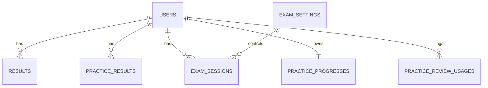
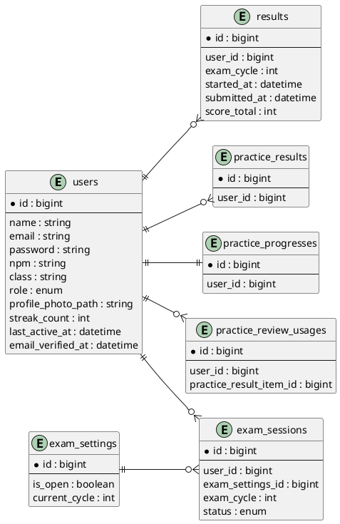
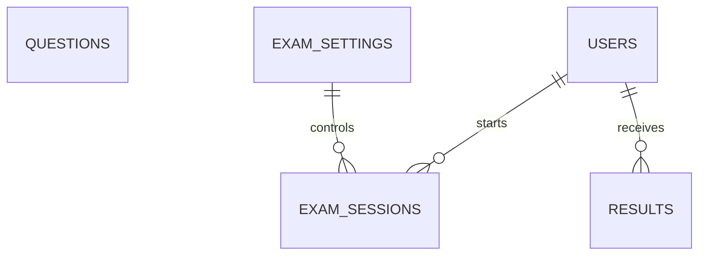
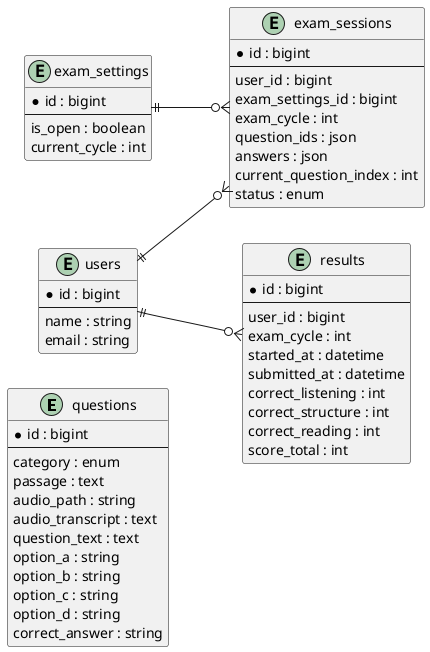
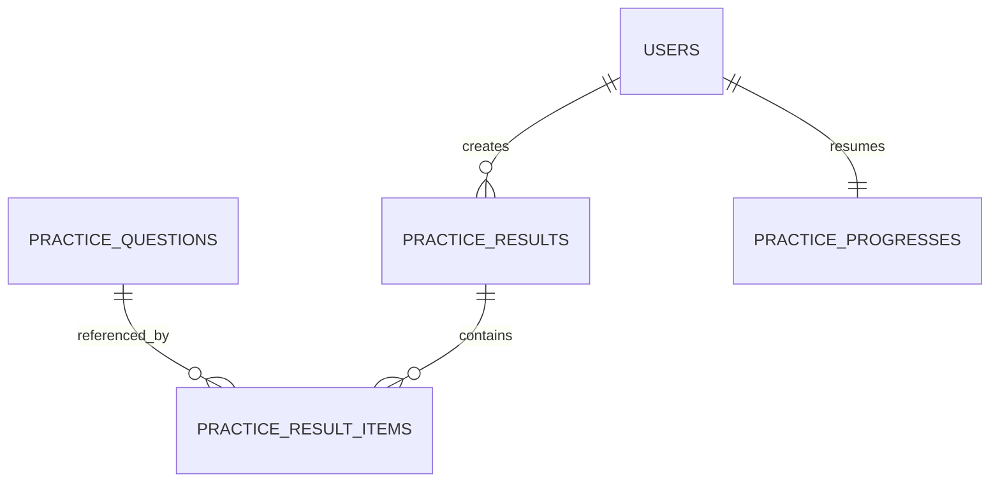
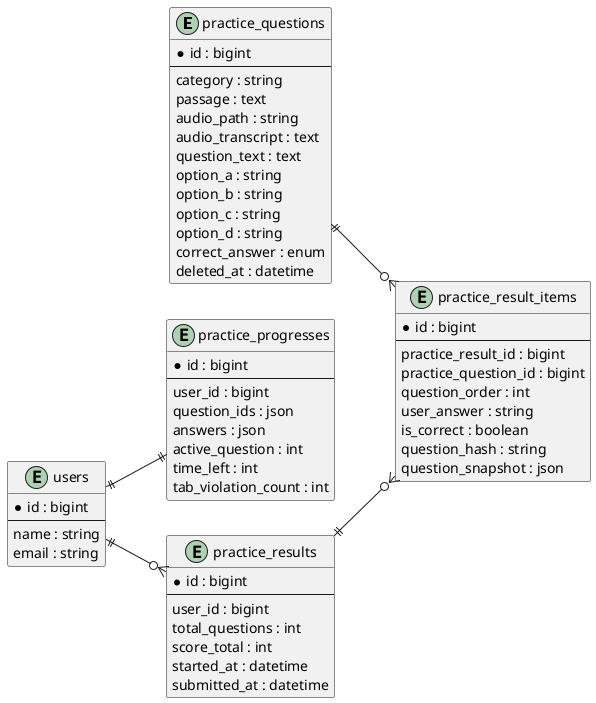
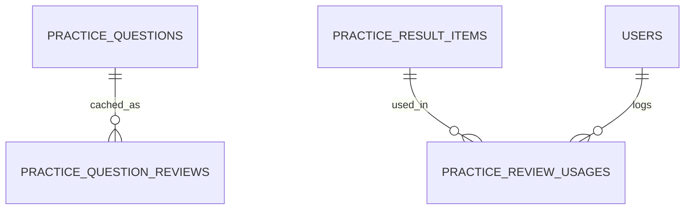
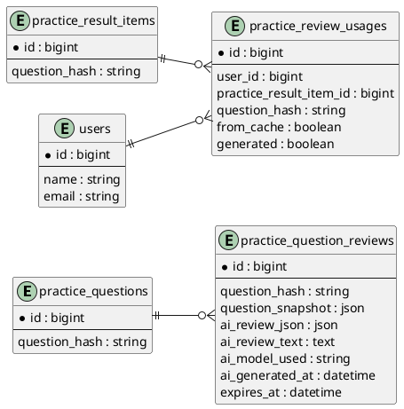

# ERD Sistem TOEFL CBT

Dokumen ini mengikuti struktur migration saat ini dan memecah ERD berdasarkan domain bisnis agar lebih mudah dibaca dan lebih akurat terhadap schema database.

## 1. Ringkasan Domain

### 1.1 Master data dan kontrol
- `users`
- `exam_settings`

### 1.2 Ujian
- `questions`
- `exam_sessions`
- `results`

### 1.3 Latihan
- `practice_questions`
- `practice_progresses`
- `practice_results`
- `practice_result_items`

### 1.4 AI dan cache review
- `practice_question_reviews`
- `practice_review_usages`

### 1.5 Tabel framework yang biasanya tidak masuk ERD bisnis
- `jobs`
- `failed_jobs`
- `password_reset_tokens`
- `personal_access_tokens`

## 2. ERD Master Data dan Kontrol

```mermaid
erDiagram
    USERS ||--o{ RESULTS : has
    USERS ||--o{ PRACTICE_RESULTS : has
    USERS ||--o{ EXAM_SESSIONS : has
    USERS ||--|| PRACTICE_PROGRESSES : owns
    USERS ||--o{ PRACTICE_REVIEW_USAGES : logs

    EXAM_SETTINGS ||--o{ EXAM_SESSIONS : controls
```

```plantuml
@startuml
left to right direction

entity "users" as users {
  * id : bigint
  --
  name : string
  email : string
  password : string
  npm : string
  class : string
  role : enum
  profile_photo_path : string
  streak_count : int
  last_active_at : datetime
  email_verified_at : datetime
}

entity "exam_settings" as exam_settings {
  * id : bigint
  --
  is_open : boolean
  current_cycle : int
}

entity "results" as results {
  * id : bigint
  --
  user_id : bigint
  exam_cycle : int
  started_at : datetime
  submitted_at : datetime
  score_total : int
}

entity "practice_results" as practice_results {
  * id : bigint
  --
  user_id : bigint
}

entity "exam_sessions" as exam_sessions {
  * id : bigint
  --
  user_id : bigint
  exam_settings_id : bigint
  exam_cycle : int
  status : enum
}

entity "practice_progresses" as practice_progresses {
  * id : bigint
  --
  user_id : bigint
}

entity "practice_review_usages" as practice_review_usages {
  * id : bigint
  --
  user_id : bigint
  practice_result_item_id : bigint
}

users ||--o{ results
users ||--o{ practice_results
users ||--o{ exam_sessions
users ||--|| practice_progresses
users ||--o{ practice_review_usages
exam_settings ||--o{ exam_sessions

@enduml
```

### `users`
Menyimpan akun admin dan mahasiswa.

- PK: `id`
- Unique: `email`
- Kolom penting: `name`, `email`, `password`, `npm`, `class`, `role`, `profile_photo_path`, `streak_count`, `last_active_at`, `email_verified_at`
- Relasi:
  - 1..N ke `results`
  - 1..N ke `practice_results`
  - 1..N ke `exam_sessions`
  - 1..1 ke `practice_progresses`
  - 1..N ke `practice_review_usages`

### `exam_settings`
Konfigurasi global status ujian.

- PK: `id`
- Kolom penting: `is_open`, `current_cycle`
- Catatan:
  - Dipakai seperti singleton config oleh aplikasi.
  - Tidak memiliki foreign key keluar.

## 3. ERD Ujian

```mermaid
erDiagram
    QUESTIONS

    USERS ||--o{ EXAM_SESSIONS : starts
    EXAM_SETTINGS ||--o{ EXAM_SESSIONS : controls
    USERS ||--o{ RESULTS : receives
```

```plantuml
@startuml
left to right direction

entity "questions" as questions {
  * id : bigint
  --
  category : enum
  passage : text
  audio_path : string
  audio_transcript : text
  question_text : text
  option_a : string
  option_b : string
  option_c : string
  option_d : string
  correct_answer : string
}

entity "exam_sessions" as exam_sessions {
  * id : bigint
  --
  user_id : bigint
  exam_settings_id : bigint
  exam_cycle : int
  question_ids : json
  answers : json
  current_question_index : int
  status : enum
}

entity "results" as results {
  * id : bigint
  --
  user_id : bigint
  exam_cycle : int
  started_at : datetime
  submitted_at : datetime
  correct_listening : int
  correct_structure : int
  correct_reading : int
  score_total : int
}

entity "users" as users {
  * id : bigint
  --
  name : string
  email : string
}

entity "exam_settings" as exam_settings {
  * id : bigint
  --
  is_open : boolean
  current_cycle : int
}

users ||--o{ exam_sessions
exam_settings ||--o{ exam_sessions
users ||--o{ results

@enduml
```

### `questions`
Bank soal ujian utama.

- PK: `id`
- Kolom penting: `category`, `passage`, `audio_path`, `audio_transcript`, `question_text`, `option_a`, `option_b`, `option_c`, `option_d`, `correct_answer`
- Catatan:
  - Tidak memiliki foreign key ke tabel lain.
  - Dipakai sebagai sumber soal ujian, lalu ringkasan hasilnya disimpan di `results`.

### `exam_sessions`
Menyimpan state ujian yang sedang berjalan.

- PK: `id`
- FK: `user_id` -> `users.id` dengan cascade delete
- FK: `exam_settings_id` -> `exam_settings.id` dengan cascade delete
- Kolom penting: `exam_cycle`, `question_ids` (JSON), `answers` (JSON), `current_question_index`, `status`, `started_at`, `submitted_at`, `abandoned_at`
- Enum status: `in_progress`, `submitted`, `abandoned`
- Index penting: `user_id + exam_cycle`, `exam_settings_id + status`, `created_at`

### `results`
Rekap hasil ujian resmi per user.

- PK: `id`
- FK: `user_id` -> `users.id` dengan cascade delete
- Kolom penting: `exam_cycle`, `started_at`, `submitted_at`, `correct_listening`, `correct_structure`, `correct_reading`, `score_total`
- Kolom AI: `ai_suggestion`, `ai_generated_at`, `ai_model_used`, `ai_parsed_json`, `ai_parser_version`, `ai_status`, `ai_error`, `ai_requested_at`, `ai_completed_at`
- Kolom JSON: `ai_parsed_json`
- Index penting: `exam_cycle`, `user_id + ai_status`, `exam_cycle + submitted_at + user_id + score_total`

## 4. ERD Latihan

```mermaid
erDiagram
    PRACTICE_QUESTIONS ||--o{ PRACTICE_RESULT_ITEMS : referenced_by
    PRACTICE_RESULTS ||--o{ PRACTICE_RESULT_ITEMS : contains
    USERS ||--|| PRACTICE_PROGRESSES : resumes
    USERS ||--o{ PRACTICE_RESULTS : creates
```

```plantuml
@startuml
left to right direction

entity "practice_questions" as practice_questions {
  * id : bigint
  --
  category : string
  passage : text
  audio_path : string
  audio_transcript : text
  question_text : text
  option_a : string
  option_b : string
  option_c : string
  option_d : string
  correct_answer : enum
  deleted_at : datetime
}

entity "practice_progresses" as practice_progresses {
  * id : bigint
  --
  user_id : bigint
  question_ids : json
  answers : json
  active_question : int
  time_left : int
  tab_violation_count : int
}

entity "practice_results" as practice_results {
  * id : bigint
  --
  user_id : bigint
  total_questions : int
  score_total : int
  started_at : datetime
  submitted_at : datetime
}

entity "practice_result_items" as practice_result_items {
  * id : bigint
  --
  practice_result_id : bigint
  practice_question_id : bigint
  question_order : int
  user_answer : string
  is_correct : boolean
  question_hash : string
  question_snapshot : json
}

entity "users" as users {
  * id : bigint
  --
  name : string
  email : string
}

practice_results ||--o{ practice_result_items
practice_questions ||--o{ practice_result_items
users ||--|| practice_progresses
users ||--o{ practice_results

@enduml
```

### `practice_questions`
Bank soal latihan yang terpisah dari soal ujian.

- PK: `id`
- Kolom penting: `category`, `passage`, `audio_path`, `audio_transcript`, `question_text`, `option_a`, `option_b`, `option_c`, `option_d`, `correct_answer`, `deleted_at`
- Catatan:
  - Menggunakan soft delete.
  - `category` pada tabel ini berupa string biasa, bukan enum.

### `practice_progresses`
Menyimpan progress latihan yang belum selesai.

- PK: `id`
- FK: `user_id` -> `users.id` dengan cascade delete
- Unique: `user_id`
- Kolom penting: `question_ids` (JSON), `answers` (JSON), `active_question`, `time_left`, `tab_violation_count`
- Index penting: `user_id + updated_at`
- Catatan:
  - Satu user hanya boleh punya satu progress aktif.

### `practice_results`
Rekap hasil latihan per user.

- PK: `id`
- FK: `user_id` -> `users.id` dengan cascade delete
- Kolom penting: `total_questions`, `correct_listening`, `correct_structure`, `correct_reading`, `score_total`, `started_at`, `submitted_at`
- Kolom AI: `ai_suggestion`, `ai_generated_at`, `ai_model_used`, `ai_parsed_json`, `ai_parser_version`, `ai_status`, `ai_error`, `ai_requested_at`, `ai_completed_at`
- Kolom JSON: `ai_parsed_json`
- Index penting: `user_id + submitted_at`, `user_id + ai_status`

### `practice_result_items`
Detail per soal untuk satu hasil latihan.

- PK: `id`
- FK: `practice_result_id` -> `practice_results.id` dengan cascade delete
- FK opsional: `practice_question_id` -> `practice_questions.id` dengan null on delete
- Kolom penting: `question_order`, `user_answer`, `is_correct`, `question_hash`, `question_snapshot`
- Kolom JSON: `question_snapshot`
- Index penting: `question_hash`, `practice_result_id + question_order`
- Catatan:
  - Tabel ini sudah tidak menyimpan duplikasi `category`, `question_text`, `option_a` sampai `option_d`, dan `correct_answer`.
  - Fungsinya adalah menyimpan detail attempt dan snapshot referensi, bukan sebagai pivot many-to-many.

## 5. ERD AI dan Cache Review

```mermaid
erDiagram
    PRACTICE_QUESTIONS ||--o{ PRACTICE_QUESTION_REVIEWS : cached_as
    PRACTICE_RESULT_ITEMS ||--o{ PRACTICE_REVIEW_USAGES : used_in
    USERS ||--o{ PRACTICE_REVIEW_USAGES : logs
```

```plantuml
@startuml
left to right direction

entity "practice_questions" as practice_questions {
  * id : bigint
  --
  question_hash : string
}

entity "practice_question_reviews" as practice_question_reviews {
  * id : bigint
  --
  question_hash : string
  question_snapshot : json
  ai_review_json : json
  ai_review_text : text
  ai_model_used : string
  ai_generated_at : datetime
  expires_at : datetime
}

entity "practice_result_items" as practice_result_items {
  * id : bigint
  --
  question_hash : string
}

entity "practice_review_usages" as practice_review_usages {
  * id : bigint
  --
  user_id : bigint
  practice_result_item_id : bigint
  question_hash : string
  from_cache : boolean
  generated : boolean
}

entity "users" as users {
  * id : bigint
  --
  name : string
  email : string
}

practice_questions ||--o{ practice_question_reviews
practice_result_items ||--o{ practice_review_usages
users ||--o{ practice_review_usages

@enduml
```

### `practice_question_reviews`
Cache review AI untuk soal latihan.

- PK: `id`
- Unique: `question_hash`
- Kolom penting: `question_hash`, `question_snapshot`, `ai_review_json`, `ai_review_text`, `ai_model_used`, `ai_generated_at`, `expires_at`
- Kolom JSON: `question_snapshot`, `ai_review_json`
- Index penting: `expires_at`
- Catatan:
  - Tidak memiliki foreign key langsung.
  - Terhubung secara logis ke soal lewat `question_hash`.

### `practice_review_usages`
Log penggunaan review AI.

- PK: `id`
- FK: `user_id` -> `users.id` dengan cascade delete
- FK: `practice_result_item_id` -> `practice_result_items.id` dengan cascade delete
- Kolom penting: `question_hash`, `from_cache`, `generated`, `created_at`, `updated_at`
- Index penting: `question_hash`, `user_id + generated + created_at`
- Catatan:
  - Secara praktik berperan seperti tabel audit/join untuk penggunaan review AI.

## 6. Relasi Utama yang Relevan

- `users` 1..N `results`
- `users` 1..N `practice_results`
- `users` 1..N `exam_sessions`
- `users` 1..1 `practice_progresses`
- `users` 1..N `practice_review_usages`
- `exam_settings` 1..N `exam_sessions`
- `practice_results` 1..N `practice_result_items`
- `practice_questions` 1..N `practice_result_items`
- `practice_questions` 1..N `practice_question_reviews` secara logis lewat `question_hash`
- `practice_result_items` 1..N `practice_review_usages`

## 7. Catatan Akurasi Schema

- `questions` dan `practice_questions` adalah bank soal terpisah.
- `results` dan `practice_results` hanya menyimpan rekap, bukan detail jawaban per soal.
- `exam_sessions` menyimpan state ujian yang masih berjalan.
- `practice_progresses` dipakai untuk melanjutkan latihan yang belum selesai.
- `practice_result_items` adalah detail attempt, sedangkan snapshot soal disimpan agar histori tetap konsisten walau bank soal berubah.
- Field AI memang ada di `results` dan `practice_results` karena aplikasi menyimpan saran AI setelah ujian atau latihan selesai.
- Tabel framework seperti `jobs`, `failed_jobs`, `password_reset_tokens`, dan `personal_access_tokens` sebaiknya dipisahkan dari ERD bisnis utama.

## 8. Catatan Pemakaian PlantUML

- Diagram PlantUML di atas memakai notasi entity relationship, bukan class diagram.
- Untuk tugas akhir, kamu bisa memilih salah satu format saja jika diminta dosen, tetapi struktur entity dan relasinya tetap sama.
- Jika mau, blok PlantUML ini bisa dipindah ke file `.puml` terpisah per domain agar lebih rapi saat dikompilasi.

