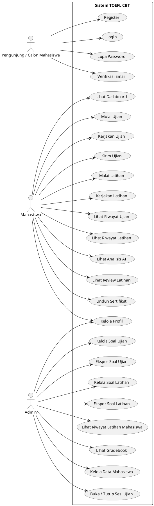

# Use Case Diagram Sistem TOEFL CBT

## Contoh Kasus: Sistem TOEFL CBT

**Actor:**
- Pengunjung / Calon Mahasiswa
- Mahasiswa
- Admin

**Use Case:**
- Pengunjung / Calon Mahasiswa dapat melakukan **Register**, **Login**, **Lupa Password**, dan **Verifikasi Email**.
- Mahasiswa dapat melakukan **Lihat Dashboard**, **Mulai Ujian**, **Kerjakan Ujian**, **Kirim Ujian**, **Mulai Latihan**, **Kerjakan Latihan**, **Lihat Riwayat Ujian**, **Lihat Riwayat Latihan**, **Lihat Analisis AI**, **Lihat Review Latihan**, **Unduh Sertifikat**, dan **Kelola Profil**.
- Admin dapat melakukan **Kelola Soal Ujian**, **Ekspor Soal Ujian**, **Kelola Soal Latihan**, **Ekspor Soal Latihan**, **Lihat Riwayat Latihan Mahasiswa**, **Lihat Gradebook**, **Kelola Data Mahasiswa**, **Buka / Tutup Sesi Ujian**, dan **Kelola Profil**.

## Penjelasan

Use Case Diagram adalah diagram UML (Unified Modeling Language) yang menggambarkan interaksi antara pengguna (disebut *actor*) dengan sistem. Diagram ini fokus pada apa yang bisa dilakukan oleh sistem dari sudut pandang pengguna, bukan pada bagaimana sistem tersebut diimplementasikan.

## Ringkasan Use Case per Actor

### 1. Pengunjung / Calon Mahasiswa
- Register akun
- Login ke sistem
- Lupa password
- Reset password
- Verifikasi email

### 2. Mahasiswa
- Melihat dashboard
- Mengikuti ujian TOEFL
- Mengikuti latihan TOEFL
- Melihat hasil ujian
- Melihat riwayat ujian
- Melihat riwayat latihan
- Melihat analisis AI untuk hasil ujian
- Melihat review AI pada soal latihan
- Mengunduh sertifikat
- Mengubah profil akun
- Mengubah password
- Menghapus akun

### 3. Admin
- Mengelola bank soal ujian
- Mengelola bank soal latihan
- Menambahkan, mengubah, dan menghapus soal
- Mengekspor data soal ke CSV
- Melihat riwayat latihan mahasiswa
- Melihat gradebook / laporan hasil ujian
- Melihat daftar mahasiswa
- Menghapus data mahasiswa
- Membuka dan menutup sesi ujian
- Mengubah profil admin
- Mengubah password admin
- Menghapus akun admin

## Versi Diagram (PlantUML)

## Catatan

- Jika dokumen ini dipakai untuk laporan, Anda bisa menampilkan diagram PlantUML di atas sebagai versi visualnya.
- Jika ingin versi yang lebih sederhana, actor dapat dipadatkan menjadi 3: **Guest**, **Mahasiswa**, dan **Admin**.
- Jika ingin versi lebih lengkap, aktor eksternal seperti layanan AI dapat ditambahkan sebagai actor tambahan untuk proses analisis dan review otomatis.